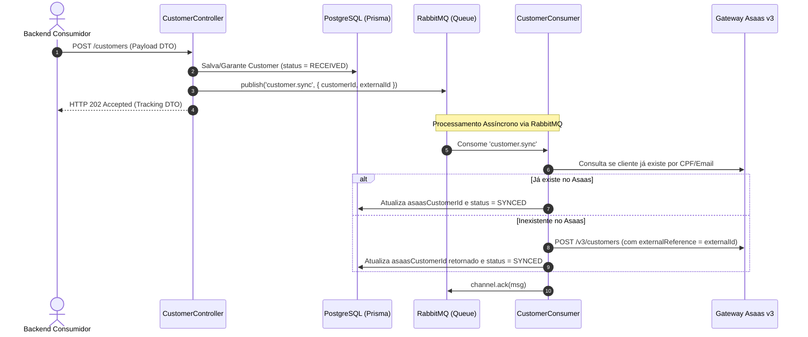

# SP-01: Módulo de Clientes Assíncrono (Customers)

- **Sprint**: 1
- **Status**: Concluído
- **Dependências**: [SP-00-setup-infrastructure.md](file:///c:/Users/victo/dev/asaas_api/story-points/SP-00-setup-infrastructure.md)
- **Objetivo**: Implementar o módulo de gestão e sincronização assíncrona de clientes Asaas com base no `externalId`, retornando `HTTP 202 Accepted` no endpoint de comando, processando a sincronização com o Asaas através de workers do RabbitMQ e mantendo consulta síncrona local para polling.

---

## 📂 Arquivos a Criar e Modificar

```
asaas_api/
└── src/
    ├── core/
    │   └── dto/
    │       └── async-command-tracking.dto.ts     # [DTO genérico para retorno 202 Accepted]
    └── modules/
        └── customer/
            ├── spec.md                           # [DOCUMENTAÇÃO TÉCNICA OBRIGATÓRIA DO MÓDULO]
            ├── customer.module.ts
            ├── customer.controller.ts            # [POST 202 Accepted + GET /:externalId]
            ├── customer.controller.spec.ts       # [TESTE OBRIGATÓRIO]
            ├── consumers/
            │   ├── customer.consumer.ts          # [@EventPattern('customer.sync')]
            │   └── customer.consumer.spec.ts     # [TESTE OBRIGATÓRIO]
            ├── dto/
            │   ├── create-or-get-customer.dto.ts
            │   └── customer-response.dto.ts
            ├── repositories/
            │   ├── customer.repository.interface.ts
            │   └── prisma-customer.repository.ts
            └── use-cases/
                ├── sync-customer.use-case.ts
                ├── sync-customer.use-case.spec.ts        # [TESTE OBRIGATÓRIO]
                ├── get-customer-by-external-id.use-case.ts
                └── get-customer-by-external-id.use-case.spec.ts # [TESTE OBRIGATÓRIO]
```

---

## 📑 Mapeamento Asaas (Postman Collection)

### 1. Criar novo cliente
- **Método**: `POST {{baseUrl}}/v3/customers`
- **Headers**: `access_token: <apiKey>`, `Content-Type: application/json`
- **Request Body**:
  ```json
  {
    "name": "John Doe",
    "cpfCnpj": "24971563792",
    "email": "john.doe@asaas.com.br",
    "phone": "4738010919",
    "externalReference": "user_uuid_123"
  }
  ```

### 2. Buscar cliente no Asaas
- **Método**: `GET {{baseUrl}}/v3/customers?email=...&cpfCnpj=...&externalReference=...`

---

## 🧩 Contratos da API Local

### 1. `POST /customers` (Comando Assíncrono)
Valida a requisição, persiste ou atualiza a intenção no PostgreSQL com status `RECEIVED`, emite evento `customer.sync` no RabbitMQ e responde **HTTP 202 Accepted**.

**Request Body (`CreateOrGetCustomerDto`)**:
```typescript
export class CreateOrGetCustomerDto {
  @ApiProperty({ description: 'ID de referência externa no backend consumidor' })
  @IsString()
  @IsNotEmpty()
  externalId: string;

  @ApiProperty({ description: 'Nome completo do cliente' })
  @IsString()
  @MinLength(3)
  name: string;

  @ApiProperty({ description: 'E-mail do cliente' })
  @IsEmail()
  email: string;

  @ApiPropertyOptional({ description: 'CPF ou CNPJ (apenas dígitos)' })
  @IsOptional()
  @IsString()
  cpfCnpj?: string;

  @ApiPropertyOptional({ description: 'Telefone com DDD' })
  @IsOptional()
  @IsString()
  phone?: string;
}
```

**Response (HTTP 202 Accepted - `AsyncCommandTrackingDto`)**:
```json
{
  "trackingId": "d3b07384-d113-469b-b51f-5e488d5e1b20",
  "status": "RECEIVED",
  "message": "Solicitação de sincronização de cliente enfileirada com sucesso.",
  "createdAt": "2026-09-10T15:30:00.000Z",
  "checkStatusUrl": "/customers/user_uuid_123"
}
```

### 2. `GET /customers/:externalId` (Consulta Síncrona de Leitura)
Retorna o estado atual do cliente no PostgreSQL local (útil para polling do backend consumidor).

**Response (HTTP 200 OK - `CustomerResponseDto`)**:
```json
{
  "id": "d3b07384-d113-469b-b51f-5e488d5e1b20",
  "externalId": "user_uuid_123",
  "asaasCustomerId": "cus_000005401844",
  "name": "John Doe",
  "email": "john.doe@asaas.com.br",
  "status": "SYNCED",
  "failureReason": null,
  "createdAt": "2026-09-10T15:30:00.000Z",
  "updatedAt": "2026-09-10T15:30:02.000Z"
}
```

---

## ⚙️ Arquitetura Orientada a Eventos: `CustomerConsumer` & `SyncCustomerUseCase`



---

## 🧪 TESTES UNITÁRIOS OBRIGATÓRIOS

### 1. `src/modules/customer/customer.controller.spec.ts`
- [ ] **Despacho Assíncrono**: Deve persistir localmente com status `RECEIVED`, chamar `eventPublisher.publish('customer.sync', ...)` e retornar `202 Accepted` sem chamar a API Asaas síncrona.

### 2. `src/modules/customer/consumers/customer.consumer.spec.ts`
- [ ] **Consumo com Sucesso**: Deve chamar `SyncCustomerUseCase` e efetuar `channel.ack(originalMsg)`.
- [ ] **Tratamento de Falha**: Em caso de falha de negócio não retentável, deve marcar status `FAILED` no banco e fazer `ack()`; em caso de erro transitório de infraestrutura, deve fazer `nack(msg, false, true)`.

### 3. `src/modules/customer/use-cases/sync-customer.use-case.spec.ts`
- [ ] **Cliente já existente no Asaas**: Localiza no Asaas, vincula `asaasCustomerId` e atualiza status para `SYNCED`.
- [ ] **Cliente novo**: Cria no Asaas com `externalReference`, salva e atualiza para `SYNCED`.
- [ ] **Erro de Validação Asaas**: Se Asaas rejeitar, marca status como `FAILED` com a mensagem em `failureReason`.

### 4. `src/modules/customer/use-cases/get-customer-by-external-id.use-case.spec.ts`
- [ ] **Registro Encontrado**: Retorna entidade tipada.
- [ ] **Registro Não Encontrado**: Lança `NotFoundException`.

---

## 🤖 Prompt de Execução Autônoma

```markdown
Execute as tarefas do SP-01:
1. Crie CreateOrGetCustomerDto, CustomerResponseDto e o genérico AsyncCommandTrackingDto.
2. Crie a interface ICustomerRepository e a implementação PrismaCustomerRepository com métodos de busca por externalId, persistência e atualização de status/failureReason.
3. Crie CustomerController com:
   - POST /customers: valida payload, garante registro local com status RECEIVED, publica evento 'customer.sync' via IEventPublisher e retorna HTTP 202 Accepted.
   - GET /customers/:externalId: busca síncrona no banco local.
4. Crie CustomerConsumer escutando @EventPattern('customer.sync') com confirmação manual no RmqContext (channel.ack / channel.nack).
5. Crie SyncCustomerUseCase orquestrando a sincronização com AsaasClientProvider e atualizando o status local.
6. Crie GetCustomerByExternalIdUseCase.
7. Conecte CustomerConsumer e CustomerController no CustomerModule.
8. Crie src/modules/customer/spec.md documentando a especificação completa do módulo de clientes (Bounded Context, DTOs, EventPattern 'customer.sync', regras de idempotência e casos de teste).
9. Implemente 100% dos testes unitários obrigatórios (controller, consumer, sync use-case e get use-case).
10. Valide executando: npm test -- src/modules/customer e npm run build.
```

---

## 🚦 Critérios de Aceite

1. `POST /customers` responde com `202 Accepted` em < 25ms.
2. O worker consome `customer.sync` do RabbitMQ e sincroniza o cliente com o Asaas com confirmação manual no canal.
3. O arquivo `src/modules/customer/spec.md` está criado e completamente preenchido com os contratos e fluxos do módulo.
4. `GET /customers/:externalId` retorna os dados do cliente e status atual (`RECEIVED`, `SYNCED` ou `FAILED`).
5. 100% dos testes unitários passam (`npm test -- src/modules/customer`).
6. `npm run build` compila sem erros.
