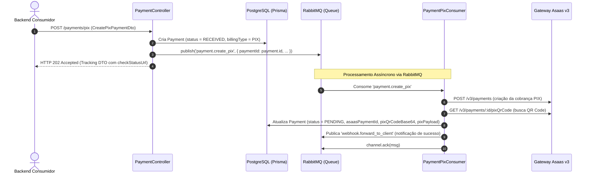

# SP-02: Módulo de Cobranças PIX Assíncrono & Split

- **Sprint**: 2
- **Status**: Concluído
- **Dependências**: [SP-00-setup-infrastructure.md](file:///c:/Users/victo/dev/asaas_api/story-points/SP-00-setup-infrastructure.md), [SP-01-customers.md](file:///c:/Users/victo/dev/asaas_api/story-points/SP-01-customers.md)
- **Objetivo**: Implementar emissão assíncrona de cobranças PIX e Split via RabbitMQ, retornando `HTTP 202 Accepted` de forma imediata ao backend consumidor, processando a criação da cobrança e captura do QR Code (Base64 e Copia-e-Cola) no worker do RabbitMQ, e fornecendo endpoint `GET /payments/:id` para consulta síncrona / polling.

---

## 📂 Arquivos a Criar e Modificar

```
asaas_api/
└── src/
    └── modules/
        └── payment/
            ├── spec.md                          # [DOCUMENTAÇÃO TÉCNICA OBRIGATÓRIA DO MÓDULO]
            ├── payment.module.ts
            ├── payment.controller.ts            # [POST /payments/pix (202 Accepted) & GET /payments/:id]
            ├── payment.controller.spec.ts       # [TESTE OBRIGATÓRIO]
            ├── consumers/
            │   ├── payment-pix.consumer.ts      # [@EventPattern('payment.create_pix')]
            │   └── payment-pix.consumer.spec.ts # [TESTE OBRIGATÓRIO]
            ├── dto/
            │   ├── create-pix-payment.dto.ts
            │   ├── payment-split.dto.ts
            │   └── payment-details-response.dto.ts
            ├── repositories/
            │   ├── payment.repository.interface.ts
            │   └── prisma-payment.repository.ts
            └── use-cases/
                ├── process-pix-payment.use-case.ts
                ├── process-pix-payment.use-case.spec.ts # [TESTE OBRIGATÓRIO]
                ├── get-payment.use-case.ts
                └── get-payment.use-case.spec.ts        # [TESTE OBRIGATÓRIO]
```

---

## 📑 Mapeamento Asaas (Postman Collection)

### 1. Criar Cobrança PIX
- **Método**: `POST {{baseUrl}}/v3/payments`
- **Request Body**:
  ```json
  {
    "customer": "cus_000005401844",
    "billingType": "PIX",
    "value": 150.00,
    "dueDate": "2026-09-15",
    "description": "Pedido #1024",
    "externalReference": "order_uuid_1024",
    "split": [
      {
        "walletId": "bbf67496-1379-4b6d-a348-fd5fa229f1c",
        "fixedValue": 30.00,
        "description": "Comissão Parceiro"
      }
    ]
  }
  ```

### 2. Obter QR Code PIX (Copia-e-Cola e Imagem Base64)
- **Método**: `GET {{baseUrl}}/v3/payments/:id/pixQrCode`
- **Response**:
  ```json
  {
    "encodedImage": "iVBORw0KGgoAAAANSUhEUgAAAMgAAADICAYAAACtWK6e...",
    "payload": "00020101021226730014br.gov.bcb.pix2551pix-h.asaas.com/pixqrcode/cobv/pay_08022591325253039865802BR5905ASAAS6009Joinville61088922827162070503***63045E7A",
    "expirationDate": "2026-09-15 23:59:59"
  }
  ```

---

## 🧩 Contratos da API Local

### 1. `POST /payments/pix` (Comando Assíncrono)
Valida a requisição, localiza o cliente, salva o pagamento com status `RECEIVED`, emite o evento `payment.create_pix` no RabbitMQ e responde imediatamente com **HTTP 202 Accepted**.

**Request Body (`CreatePixPaymentDto`)**:
```typescript
export class PaymentSplitDto {
  @ApiProperty({ description: 'ID da carteira Asaas destino do split' })
  @IsString()
  @IsNotEmpty()
  walletId: string;

  @ApiPropertyOptional({ description: 'Valor fixo repassado à carteira' })
  @IsOptional()
  @IsNumber()
  @IsPositive()
  fixedValue?: number;

  @ApiPropertyOptional({ description: 'Percentual sobre a cobrança (0 a 100)' })
  @IsOptional()
  @IsNumber()
  @Min(0.01)
  @Max(100)
  percentualValue?: number;

  @ApiPropertyOptional({ description: 'Descrição interna do split' })
  @IsOptional()
  @IsString()
  description?: string;
}

export class CreatePixPaymentDto {
  @ApiProperty({ description: 'ID local do Customer ou externalId do cliente' })
  @IsString()
  @IsNotEmpty()
  customerId: string;

  @ApiProperty({ description: 'Valor da cobrança em Reais', example: 150.00 })
  @IsNumber()
  @IsPositive()
  value: number;

  @ApiPropertyOptional({ description: 'Data de vencimento (YYYY-MM-DD). Se omitido, assume D+1' })
  @IsOptional()
  @IsString()
  dueDate?: string;

  @ApiPropertyOptional({ description: 'Descrição da cobrança exibida ao pagador' })
  @IsOptional()
  @IsString()
  description?: string;

  @ApiPropertyOptional({ description: 'ID de referência externa (ex: orderId)' })
  @IsOptional()
  @IsString()
  externalReference?: string;

  @ApiPropertyOptional({ description: 'Regras de split de pagamento', type: [PaymentSplitDto] })
  @IsOptional()
  @IsArray()
  @ValidateNested({ each: true })
  @Type(() => PaymentSplitDto)
  split?: PaymentSplitDto[];
}
```

**Response (HTTP 202 Accepted - `AsyncCommandTrackingDto`)**:
```json
{
  "trackingId": "b1b7029b-98b7-4f6c-8463-b8c73229b011",
  "status": "RECEIVED",
  "message": "Cobrança PIX recebida e enfileirada para processamento.",
  "createdAt": "2026-09-10T15:30:00.000Z",
  "checkStatusUrl": "/payments/b1b7029b-98b7-4f6c-8463-b8c73229b011"
}
```

### 2. `GET /payments/:id` (Consulta Síncrona de Leitura / Polling)
Retorna os dados do pagamento persistidos no banco local.

**Response (HTTP 200 OK - `PaymentDetailsResponseDto`)**:
```json
{
  "id": "b1b7029b-98b7-4f6c-8463-b8c73229b011",
  "customerId": "d3b07384-d113-469b-b51f-5e488d5e1b20",
  "asaasPaymentId": "pay_080225913252",
  "billingType": "PIX",
  "status": "PENDING",
  "value": 150.00,
  "netValue": 148.01,
  "dueDate": "2026-09-15T00:00:00.000Z",
  "invoiceUrl": "https://sandbox.asaas.com/i/080225913252",
  "externalReference": "order_uuid_1024",
  "pixQrCodeBase64": "iVBORw0KGgoAAAANSUhEUgAAAMgAAADICAYAAACtWK6e...",
  "pixPayload": "00020101021226730014br.gov.bcb.pix2551pix-h.asaas.com...",
  "pixExpirationDate": "2026-09-15T23:59:59.000Z",
  "failureReason": null,
  "createdAt": "2026-09-10T15:30:00.000Z",
  "updatedAt": "2026-09-10T15:30:02.000Z"
}
```

---

## ⚙️ Arquitetura Orientada a Eventos: `PaymentPixConsumer` & `ProcessPixPaymentUseCase`



---

## 🧪 TESTES UNITÁRIOS OBRIGATÓRIOS

### 1. `src/modules/payment/payment.controller.spec.ts`
- [ ] **Despacho Assíncrono PIX**: Deve persistir com status `RECEIVED`, emitir `payment.create_pix` via `IEventPublisher` e responder `202 Accepted` imediatamente com o ID do recurso.

### 2. `src/modules/payment/consumers/payment-pix.consumer.spec.ts`
- [ ] **Consumo com Sucesso**: Executa `ProcessPixPaymentUseCase` e chama `channel.ack(originalMsg)`.
- [ ] **Tratamento de Falha Não Retentável**: Se Asaas retornar erro 400 definitivo, atualiza status para `FAILED`, persiste `failureReason` e faz `channel.ack(originalMsg)` para não travar a fila.

### 3. `src/modules/payment/use-cases/process-pix-payment.use-case.spec.ts`
- [ ] **Happy Path**: Chama Asaas para criar cobrança, chama rota de QR Code, persiste dados completos e atualiza status para `PENDING`.
- [ ] **Split de Pagamento**: Converte regras de split corretamente no payload enviado para o Asaas.
- [ ] **Falha no Gateway Asaas**: Trata erro da API externa e marca o pagamento como `FAILED` com justificativa.

### 4. `src/modules/payment/use-cases/get-payment.use-case.spec.ts`
- [ ] **Pagamento Encontrado**: Retorna `PaymentDetailsResponseDto`.
- [ ] **Pagamento Inexistente**: Lança `NotFoundException`.

---

## 🤖 Prompt de Execução Autônoma

```markdown
Execute as tarefas do SP-02:
1. Crie os DTOs CreatePixPaymentDto, PaymentSplitDto e PaymentDetailsResponseDto.
2. Crie a interface IPaymentRepository e a implementação PrismaPaymentRepository com métodos de criação, atualização e busca por id/asaasPaymentId.
3. Crie PaymentController com:
   - POST /payments/pix: cria registro com status RECEIVED, publica 'payment.create_pix' via IEventPublisher e retorna HTTP 202 Accepted.
   - GET /payments/:id: retorna os dados do pagamento do banco local.
4. Crie PaymentPixConsumer escutando @EventPattern('payment.create_pix') com confirmação manual no RmqContext (channel.ack / channel.nack).
5. Crie ProcessPixPaymentUseCase: integra com AsaasClientProvider (POST /v3/payments e GET /v3/payments/:id/pixQrCode) e atualiza o pagamento para PENDING com QR Code e Copia-e-Cola.
6. Crie GetPaymentUseCase.
7. Registre os componentes no PaymentModule.
8. Crie src/modules/payment/spec.md documentando a especificação técnica inicial do módulo de pagamentos (Bounded Context, DTOs, EventPattern 'payment.create_pix', regras de split e geração de QR Code).
9. Implemente 100% dos testes unitários obrigatórios (controller, consumer, process use-case e get use-case).
10. Valide executando: npm test -- src/modules/payment e npm run build.
```

---

## 🚦 Critérios de Aceite

1. `POST /payments/pix` responde com `202 Accepted` em < 30ms.
2. O worker consome `payment.create_pix`, gera a cobrança e o QR Code no Asaas e persiste no banco com status `PENDING`.
3. O arquivo `src/modules/payment/spec.md` está criado e completamente preenchido com a especificação técnica do módulo.
4. `GET /payments/:id` exibe os dados atualizados incluindo `pixQrCodeBase64` e `pixPayload`.
5. 100% dos testes unitários passam (`npm test -- src/modules/payment`).
6. O build compila sem erros (`npm run build`).
