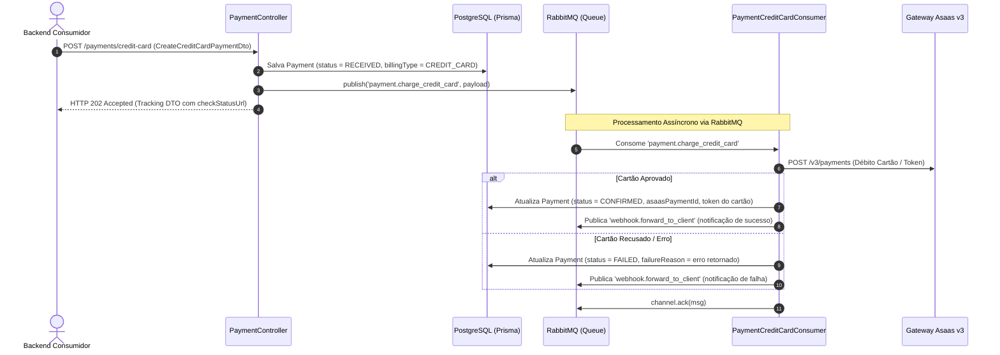

# SP-03: Módulo de Cartão de Crédito Assíncrono (Avulso & Parcelado)

- **Sprint**: 3
- **Status**: Concluído
- **Dependências**: [SP-00-setup-infrastructure.md](file:///c:/Users/victo/dev/asaas_api/story-points/SP-00-setup-infrastructure.md), [SP-01-customers.md](file:///c:/Users/victo/dev/asaas_api/story-points/SP-01-customers.md), [SP-02-pix-payments-split.md](file:///c:/Users/victo/dev/asaas_api/story-points/SP-02-pix-payments-split.md)
- **Objetivo**: Implementar cobranças com Cartão de Crédito de forma 100% orientada a eventos via RabbitMQ, suportando tanto dados do cartão quanto token reutilizável (`creditCardToken`), parcelamento e split. O endpoint HTTP responde de imediato `HTTP 202 Accepted`, enquanto o worker do RabbitMQ processa o débito junto ao Asaas e registra o resultado e tokenização no banco local.

---

## 📂 Arquivos a Criar e Modificar

```
asaas_api/
└── src/
    └── modules/
        └── payment/
            ├── spec.md                          # [ATUALIZAR: Documentação técnica com regras de Cartão]
            ├── payment.controller.ts (adicionar POST /payments/credit-card -> 202 Accepted)
            ├── consumers/
            │   ├── payment-credit-card.consumer.ts      # [@EventPattern('payment.charge_credit_card')]
            │   └── payment-credit-card.consumer.spec.ts # [TESTE OBRIGATÓRIO]
            ├── dto/
            │   ├── create-credit-card-payment.dto.ts
            │   ├── credit-card.dto.ts
            │   ├── credit-card-holder-info.dto.ts
            │   └── credit-card-payment-response.dto.ts
            └── use-cases/
                ├── process-credit-card-payment.use-case.ts
                └── process-credit-card-payment.use-case.spec.ts # [TESTE OBRIGATÓRIO]
```

---

## 📑 Mapeamento Asaas (Postman Collection)

### Criar Cobrança com Cartão de Crédito
- **Método**: `POST {{baseUrl}}/v3/payments`
- **Request Body (com cartão ou token)**:
  ```json
  {
    "customer": "cus_000005401844",
    "billingType": "CREDIT_CARD",
    "value": 300.00,
    "dueDate": "2026-09-10",
    "description": "Mensalidade / Compra #2048",
    "externalReference": "order_uuid_2048",
    "remoteIp": "187.12.34.56",
    "creditCard": {
      "holderName": "JOHN DOE",
      "number": "4111111111111111",
      "expiryMonth": "12",
      "expiryYear": "2028",
      "ccv": "123"
    },
    "creditCardHolderInfo": {
      "name": "John Doe",
      "email": "john.doe@asaas.com.br",
      "cpfCnpj": "24971563792",
      "postalCode": "01310-000",
      "addressNumber": "150",
      "phone": "4738010919"
    }
  }
  ```
- **Response (200 OK do Asaas)**:
  ```json
  {
    "object": "payment",
    "id": "pay_080225913253",
    "status": "CONFIRMED",
    "creditCard": {
      "creditCardNumber": "1111",
      "creditCardBrand": "VISA",
      "creditCardToken": "3673f47e-7517-4852-a548-5221081a9fd2"
    }
  }
  ```

---

## 🧩 Contratos da API Local

### 1. `POST /payments/credit-card` (Comando Assíncrono)
Valida a requisição, salva o registro com status `RECEIVED`, despacha o evento `payment.charge_credit_card` para o RabbitMQ e retorna imediatamente **HTTP 202 Accepted**.

**Request Body (`CreateCreditCardPaymentDto`)**:
```typescript
export class CreditCardDto {
  @ApiProperty({ description: 'Nome impresso no cartão' })
  @IsString()
  @IsNotEmpty()
  holderName: string;

  @ApiProperty({ description: 'Número do cartão de crédito' })
  @IsCreditCard()
  number: string;

  @ApiProperty({ description: 'Mês de expiração (MM)', example: '12' })
  @IsString()
  @Length(2, 2)
  expiryMonth: string;

  @ApiProperty({ description: 'Ano de expiração (AAAA)', example: '2028' })
  @IsString()
  @Length(4, 4)
  expiryYear: string;

  @ApiProperty({ description: 'Código de segurança (CCV)' })
  @IsString()
  @Length(3, 4)
  ccv: string;
}

export class CreateCreditCardPaymentDto {
  @ApiProperty({ description: 'ID local do Customer ou externalId' })
  @IsString()
  @IsNotEmpty()
  customerId: string;

  @ApiProperty({ description: 'Valor total da cobrança', example: 300.00 })
  @IsNumber()
  @IsPositive()
  value: number;

  @ApiProperty({ description: 'IP do cliente pagador (antifraude Asaas)', example: '187.12.34.56' })
  @IsIP()
  remoteIp: string;

  @ApiPropertyOptional({ description: 'Quantidade de parcelas (1 a 12)', default: 1 })
  @IsOptional()
  @IsInt()
  @Min(1)
  @Max(12)
  installmentCount?: number;

  @ApiPropertyOptional({ description: 'Data de vencimento (YYYY-MM-DD)' })
  @IsOptional()
  @IsString()
  dueDate?: string;

  @ApiPropertyOptional({ description: 'Descrição da cobrança' })
  @IsOptional()
  @IsString()
  description?: string;

  @ApiPropertyOptional({ description: 'Referência externa' })
  @IsOptional()
  @IsString()
  externalReference?: string;

  @ApiPropertyOptional({ description: 'Dados do cartão de crédito', type: CreditCardDto })
  @IsOptional()
  @ValidateNested()
  @Type(() => CreditCardDto)
  creditCard?: CreditCardDto;

  @ApiPropertyOptional({ description: 'Dados do titular do cartão', type: CreditCardHolderInfoDto })
  @IsOptional()
  @ValidateNested()
  @Type(() => CreditCardHolderInfoDto)
  creditCardHolderInfo?: CreditCardHolderInfoDto;

  @ApiPropertyOptional({ description: 'Token de cartão salvo previamente' })
  @IsOptional()
  @IsString()
  creditCardToken?: string;

  @ApiPropertyOptional({ description: 'Regras de split', type: [PaymentSplitDto] })
  @IsOptional()
  @IsArray()
  @ValidateNested({ each: true })
  @Type(() => PaymentSplitDto)
  split?: PaymentSplitDto[];
}
```

**Response (HTTP 202 Accepted - `AsyncCommandTrackingDto`)**:
```json
{
  "trackingId": "e5c2029b-88b7-4f6c-9463-b8c73229b999",
  "status": "RECEIVED",
  "message": "Cobrança de cartão recebida e enfileirada para processamento.",
  "createdAt": "2026-09-10T15:30:00.000Z",
  "checkStatusUrl": "/payments/e5c2029b-88b7-4f6c-9463-b8c73229b999"
}
```

---

## ⚙️ Arquitetura Orientada a Eventos: `PaymentCreditCardConsumer`



---

## 🧪 TESTES UNITÁRIOS OBRIGATÓRIOS

### 1. `src/modules/payment/payment.controller.spec.ts` (Cenário Cartão)
- [ ] **Despacho Assíncrono**: Validação de payload (deve conter `creditCard` ou `creditCardToken`), persistência de `Payment` com status `RECEIVED`, emissão do evento `payment.charge_credit_card` e retorno `202 Accepted`.

### 2. `src/modules/payment/consumers/payment-credit-card.consumer.spec.ts`
- [ ] **Consumo com Sucesso**: Invoca `ProcessCreditCardPaymentUseCase` e chama `channel.ack(msg)`.
- [ ] **Tratamento de Exceção**: Em erro de cartão recusado, atualiza status local para `FAILED` e faz `ack()` no canal.

### 3. `src/modules/payment/use-cases/process-credit-card-payment.use-case.spec.ts`
- [ ] **Cobrança com Sucesso com Cartão Bruto**: Processa no Asaas, armazena token gerado, brand e status `CONFIRMED`.
- [ ] **Cobrança com Token Salvo**: Envia `creditCardToken` diretamente sem dados brutos do cartão.
- [ ] **Tratamento de Recusa de Cartão (400 Asaas)**: Captura erro de transação não autorizada e marca pagamento como `FAILED` com a mensagem em `failureReason`.

---

## 🤖 Prompt de Execução Autônoma

```markdown
Execute as tarefas do SP-03:
1. Crie os DTOs CreditCardDto, CreditCardHolderInfoDto, CreateCreditCardPaymentDto e CreditCardPaymentResponseDto com validações via class-validator.
2. Adicione ao PaymentController a rota POST /payments/credit-card:
   - Valida obrigatoriedade mútua de creditCard ou creditCardToken.
   - Cria registro de Payment com status RECEIVED.
   - Emite evento 'payment.charge_credit_card' via IEventPublisher.
   - Retorna HTTP 202 Accepted com AsyncCommandTrackingDto.
3. Crie PaymentCreditCardConsumer escutando @EventPattern('payment.charge_credit_card') com manual ack.
4. Crie ProcessCreditCardPaymentUseCase comunicando com AsaasClientProvider para enviar a cobrança, capturar dados do cartão tokenizado e persistir o status (CONFIRMED ou FAILED).
5. Registre o novo consumer no PaymentModule.
6. Atualize src/modules/payment/spec.md documentando a integração de cartão de crédito (regras de tokenização, EventPattern 'payment.charge_credit_card' e antifraude remoteIp).
7. Implemente 100% dos testes unitários (controller, consumer e process use-case).
8. Valide executando: npm test -- src/modules/payment e npm run build.
```

---

## 🚦 Critérios de Aceite

1. `POST /payments/credit-card` responde em < 30ms com `202 Accepted`.
2. O worker consome `payment.charge_credit_card` e atualiza o pagamento para `CONFIRMED` ou `FAILED`.
3. O arquivo `src/modules/payment/spec.md` foi devidamente atualizado com as especificações e contratos de cartão de crédito.
4. 100% dos testes unitários passam (`npm test -- src/modules/payment`).
5. `npm run build` compila sem erros.
