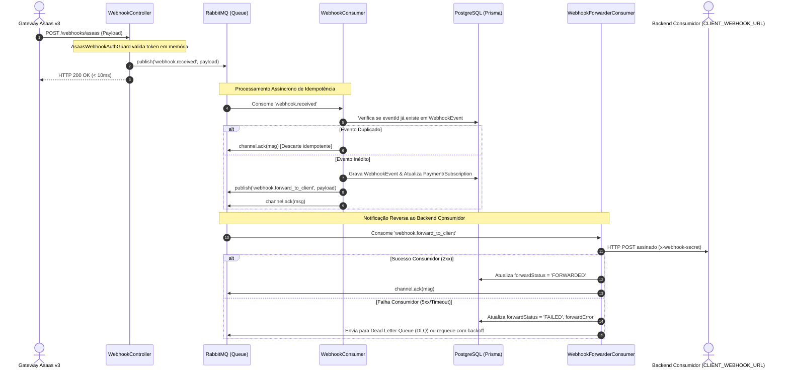

# SP-05: Webhooks Assíncronos & Mecanismo de Idempotência Estrita

- **Sprint**: 5
- **Status**: Concluído
- **Dependências**: [SP-00-setup-infrastructure.md](file:///c:/Users/victo/dev/asaas_api/story-points/SP-00-setup-infrastructure.md) a [SP-04-subscriptions-recurrence.md](file:///c:/Users/victo/dev/asaas_api/story-points/SP-04-subscriptions-recurrence.md)
- **Objetivo**: Implementar o receptor de webhooks do Asaas de forma 100% orientada a eventos. O endpoint responde `HTTP 200 OK` ao Asaas em menos de 10ms e delega o processamento da idempotência, sincronização de status e repasse para o backend consumidor (`CLIENT_WEBHOOK_URL`) através de workers dedicados no RabbitMQ com suporte a Dead Letter Queue (DLQ).

---

## 📂 Arquivos a Criar e Modificar

```
asaas_api/
└── src/
    └── modules/
        └── webhook/
            ├── spec.md                               # [DOCUMENTAÇÃO TÉCNICA OBRIGATÓRIA DO MÓDULO]
            ├── webhook.module.ts
            ├── webhook.controller.ts            # [POST /webhooks/asaas -> 200 imediato em < 10ms]
            ├── webhook.controller.spec.ts       # [TESTE OBRIGATÓRIO]
            ├── guards/
            │   ├── asaas-webhook-auth.guard.ts
            │   └── asaas-webhook-auth.guard.spec.ts      # [TESTE OBRIGATÓRIO]
            ├── consumers/
            │   ├── webhook.consumer.ts                   # [@EventPattern('webhook.received')]
            │   ├── webhook.consumer.spec.ts              # [TESTE OBRIGATÓRIO]
            │   ├── webhook-forwarder.consumer.ts         # [@EventPattern('webhook.forward_to_client')]
            │   └── webhook-forwarder.consumer.spec.ts    # [TESTE OBRIGATÓRIO]
            ├── dto/
            │   ├── asaas-webhook-payload.dto.ts
            │   └── webhook-response.dto.ts
            ├── repositories/
            │   ├── webhook-event.repository.interface.ts
            │   └── prisma-webhook-event.repository.ts
            └── use-cases/
                ├── process-asaas-webhook.use-case.ts
                └── process-asaas-webhook.use-case.spec.ts # [TESTE OBRIGATÓRIO]
```

---

## 📑 Mapeamento Asaas (Postman Collection & Documentação)

### 1. Recepção do Webhook Asaas
- **Rota Local**: `POST /webhooks/asaas`
- **Cabeçalho de Autenticação Enviado pelo Asaas**:
  `asaas-access-token: <ASAAS_WEBHOOK_SECRET>`
- **Payload Recebido (Exemplo Pagamento)**:
  ```json
  {
    "id": "evt_080225913252a",
    "event": "PAYMENT_RECEIVED",
    "dateCreated": "2026-09-10 14:35:00",
    "payment": {
      "id": "pay_080225913252",
      "customer": "cus_000005401844",
      "billingType": "PIX",
      "status": "RECEIVED",
      "value": 150.00,
      "netValue": 148.01,
      "paymentDate": "2026-09-10",
      "externalReference": "order_uuid_1024"
    }
  }
  ```

---

## 🔒 Segurança: `AsaasWebhookAuthGuard`

- Lê o cabeçalho `asaas-access-token`.
- Se ausente ou inválido: lança `UnauthorizedException` (Fail-Closed).
- Executa comparação temporal segura com `crypto.timingSafeEqual` contra `ASAAS_WEBHOOK_SECRET` para mitigar ataques de temporização.

---

## ⚙️ Arquitetura Orientada a Eventos: Webhooks Inbound & Outbound



---

## 🧪 TESTES UNITÁRIOS OBRIGATÓRIOS

### 1. `src/modules/webhook/guards/asaas-webhook-auth.guard.spec.ts`
- [ ] **Token Válido**: Retorna `true` para token idêntico.
- [ ] **Header Ausente ou Incorreto**: Lança `UnauthorizedException`.

### 2. `src/modules/webhook/webhook.controller.spec.ts`
- [ ] **Resposta Imediata**: Publica `webhook.received` no broker e retorna `200 OK` sem esperar persistência.

### 3. `src/modules/webhook/consumers/webhook.consumer.spec.ts`
- [ ] **Descarte de Duplicata (Idempotência)**: Se evento já existe, faz `channel.ack(msg)` sem alterar entidades.
- [ ] **Processamento de Novo Evento**: Salva auditoria, atualiza entidades locais e emite `webhook.forward_to_client`.

### 4. `src/modules/webhook/consumers/webhook-forwarder.consumer.spec.ts`
- [ ] **Repasse com Sucesso**: Envia payload assinado para `CLIENT_WEBHOOK_URL` e atualiza `forwardStatus: 'FORWARDED'`.
- [ ] **Resiliência a Falha do Consumidor**: Trata timeout/500 do consumidor registrando falha e gerenciando retentativas no RabbitMQ.

### 5. `src/modules/webhook/use-cases/process-asaas-webhook.use-case.spec.ts`
- [ ] **Idempotência e Atualização de Status**: Testa lógica pura de sincronização no banco.

---

## 🤖 Prompt de Execução Autônoma

```markdown
Execute as tarefas do SP-05:
1. Crie AsaasWebhookAuthGuard com timingSafeEqual.
2. Crie os DTOs AsaasWebhookPayloadDto e WebhookResponseDto.
3. Crie IWebhookEventRepository e PrismaWebhookEventRepository.
4. Crie WebhookController: protege com guard, emite 'webhook.received' via IEventPublisher e retorna 200 OK imediatamente.
5. Crie WebhookConsumer escutando @EventPattern('webhook.received'):
   - Executa idempotência estrita por eventId.
   - Atualiza status local de Payment ou Subscription.
   - Emite 'webhook.forward_to_client'.
   - Efetua channel.ack(msg).
6. Crie WebhookForwarderConsumer escutando @EventPattern('webhook.forward_to_client'):
   - Envia POST HTTP com header x-webhook-secret para CLIENT_WEBHOOK_URL.
   - Atualiza auditoria de repasse e trata falhas com ack/nack/dlq.
7. Registre os componentes no WebhookModule.
8. Crie src/modules/webhook/spec.md documentando a especificação técnica do módulo de webhooks (inbound <10ms, regras de idempotência, tabela WebhookEvent, forwarder assinado e DLQ).
9. Implemente 100% dos testes unitários obrigatórios (guard, controller, consumers e use-case).
10. Valide executando: npm test -- src/modules/webhook e npm run build.
```

---

## 🚦 Critérios de Aceite

1. O endpoint de webhook do Asaas responde `200 OK` em < 10ms.
2. Eventos duplicados são descartados sem causar alterações redundantes.
3. Repasse ao backend consumidor é executado assincronamente com controle de falha e DLQ.
4. O arquivo `src/modules/webhook/spec.md` está criado e completamente preenchido.
5. 100% dos testes unitários passam (`npm test -- src/modules/webhook`).
6. O build compila sem erros (`npm run build`).
