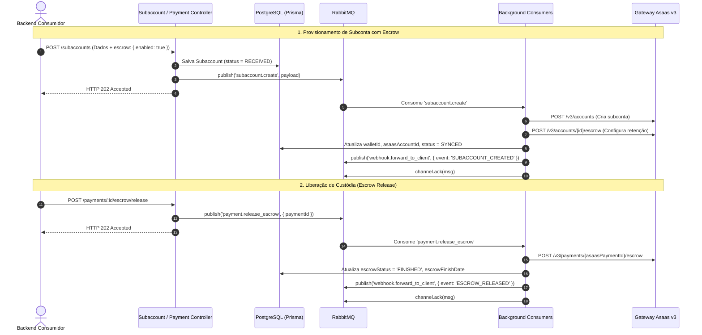

# SP-07: Módulo de Subcontas, Split Inteligente & Conta Escrow (Custódia)

- **Sprint**: 7
- **Status**: Concluído
- **Dependências**: [SP-00-setup-infrastructure.md](file:///c:/Users/victo/dev/asaas_api/story-points/SP-00-setup-infrastructure.md) a [SP-06-swagger-docker-docs.md](file:///c:/Users/victo/dev/asaas_api/story-points/SP-06-swagger-docker-docs.md)
- **Objetivo**: Implementar infraestrutura completa para marketplaces e intermediação financeira, permitindo o provisionamento assíncrono de subcontas, divisão de pagamentos (Split) com retenção em custódia (Conta Escrow) na carteira do prestador/parceiro, e liberação de garantia quando a entrega for confirmada. Foco prioritário em **Developer Experience (DX)**, desacoplamento e conformidade estrita com o padrão assíncrono (**HTTP 202 Accepted + RabbitMQ**).

---

## 💡 Diretrizes de Developer Experience (DX)

1. **Split Flexível por `subaccountExternalId`**:
   - O desenvolvedor consumidor não precisa mapear nem armazenar previamente o `walletId` do Asaas na sua aplicação.
   - O split aceita tanto `walletId` quanto `subaccountExternalId` (ex: `"freelancer_usr_123"`). O gateway local resolve o `walletId` correspondente automaticamente no banco de dados.
2. **Setup Completo em 1 Única Chamada**:
   - `POST /subaccounts` cria a subconta e, caso informado `escrow: { enabled: true }`, ativa a garantia de retenção em segundo plano sem exigir chamadas adicionais do cliente.
3. **Liberação Polimórfica de Garantia**:
   - `POST /payments/:id/escrow/release` aceita tanto o UUID interno do pagamento quanto o `externalReference` (ex: `"order_1024"`).
4. **Respostas Padronizadas (HTTP 202 Accepted)**:
   - Todas as mutações retornam em < 30ms com `AsyncCommandTrackingDto`.

---

## 📂 Arquivos a Criar e Modificar

```
asaas_api/
├── story-points/
│   ├── README.md
│   └── SP-07-subaccounts-split-escrow.md
├── prisma/
│   ├── schema.prisma
│   └── migrations/..._add_subaccounts_and_escrow/
└── src/
    ├── app.module.ts
    ├── infra/
    │   └── messaging/
    │       └── messaging.constants.ts
    └── modules/
        ├── payment/
        │   ├── payment.controller.ts
        │   ├── payment.module.ts
        │   ├── spec.md
        │   ├── dto/
        │   │   ├── payment-split.dto.ts
        │   │   └── payment-details-response.dto.ts
        │   ├── consumers/
        │   │   └── payment-escrow.consumer.ts
        │   ├── use-cases/
        │   │   ├── process-release-escrow.use-case.ts
        │   │   ├── process-pix-payment.use-case.ts
        │   │   └── process-credit-card-payment.use-case.ts
        │   └── tests/
        │       ├── payment-escrow.consumer.spec.ts
        │       └── process-release-escrow.use-case.spec.ts
        └── subaccount/
            ├── spec.md
            ├── subaccount.module.ts
            ├── subaccount.controller.ts
            ├── consumers/
            │   └── subaccount.consumer.ts
            ├── dto/
            │   ├── create-subaccount.dto.ts
            │   └── subaccount-response.dto.ts
            ├── repositories/
            │   ├── subaccount.repository.interface.ts
            │   └── prisma-subaccount.repository.ts
            ├── use-cases/
            │   ├── create-subaccount.use-case.ts
            │   └── get-subaccount-by-external-id.use-case.ts
            └── tests/
                ├── subaccount.controller.spec.ts
                ├── subaccount.consumer.spec.ts
                ├── create-subaccount.use-case.spec.ts
                └── get-subaccount-by-external-id.use-case.spec.ts
```

---

## 📑 Mapeamento Asaas v3

### 1. Criar Subconta
- **Método**: `POST {{baseUrl}}/v3/accounts`
- **Request Body**:
  ```json
  {
    "name": "João da Silva",
    "email": "joao.silva@parceiro.com",
    "cpfCnpj": "24971563792",
    "phone": "4738010919",
    "companyType": "MEI"
  }
  ```
- **Response**:
  ```json
  {
    "id": "acc_0000000001",
    "walletId": "bbf67496-1379-4b6d-a348-fd5fa229f1c",
    "name": "João da Silva",
    "email": "joao.silva@parceiro.com",
    "cpfCnpj": "24971563792"
  }
  ```

### 2. Ativar Conta Escrow na Subconta
- **Método**: `POST {{baseUrl}}/v3/accounts/:id/escrow`
- **Request Body**:
  ```json
  {
    "enabled": true,
    "daysToExpire": 30
  }
  ```

### 3. Finalizar / Liberar Garantia Escrow da Cobrança
- **Método**: `POST {{baseUrl}}/v3/payments/:id/escrow`
- **Response**:
  ```json
  {
    "id": "4f468235-cec3-482f-b3d0-348af4c7194",
    "status": "FINISHED",
    "finishReason": "MANUAL",
    "finishDate": "2026-09-17"
  }
  ```

---

## 🧩 Contratos da API Local

### 1. `POST /subaccounts` (Comando Assíncrono)
Valida a requisição, persiste no PostgreSQL com status `RECEIVED`, emite evento `subaccount.create` no RabbitMQ e responde **HTTP 202 Accepted**.

**Request Body (`CreateSubaccountDto`)**:
```typescript
export class EscrowConfigDto {
  @ApiProperty({ description: 'Ativa a retenção de valores sob custódia' })
  @IsBoolean()
  enabled: boolean;

  @ApiPropertyOptional({ description: 'Prazo em dias para expiração automática da garantia' })
  @IsOptional()
  @IsInt()
  @Min(1)
  daysToExpire?: number;
}

export class CreateSubaccountDto {
  @ApiProperty({ description: 'ID de referência no backend consumidor', example: 'freelancer_usr_123' })
  @IsString()
  @IsNotEmpty()
  externalId: string;

  @ApiProperty({ description: 'Nome completo ou Razão Social' })
  @IsString()
  @MinLength(3)
  name: string;

  @ApiProperty({ description: 'E-mail da subconta' })
  @IsEmail()
  email: string;

  @ApiProperty({ description: 'CPF ou CNPJ (apenas dígitos)' })
  @IsString()
  @IsNotEmpty()
  cpfCnpj: string;

  @ApiPropertyOptional({ description: 'Telefone comercial com DDD' })
  @IsOptional()
  @IsString()
  phone?: string;

  @ApiPropertyOptional({ description: 'Celular com DDD' })
  @IsOptional()
  @IsString()
  mobilePhone?: string;

  @ApiPropertyOptional({ description: 'Tipo de empresa', enum: ['MEI', 'LIMITED', 'INDIVIDUAL', 'ASSOCIATION'] })
  @IsOptional()
  @IsEnum(['MEI', 'LIMITED', 'INDIVIDUAL', 'ASSOCIATION'])
  companyType?: string;

  @ApiPropertyOptional({ description: 'Configuração de retenção de custódia (Escrow)', type: EscrowConfigDto })
  @IsOptional()
  @ValidateNested()
  @Type(() => EscrowConfigDto)
  escrow?: EscrowConfigDto;
}
```

**Response (HTTP 202 Accepted - `AsyncCommandTrackingDto`)**:
```json
{
  "trackingId": "subacc_uuid_123",
  "status": "RECEIVED",
  "message": "Solicitação de cadastro de subconta recebida e enfileirada para processamento.",
  "createdAt": "2026-09-17T15:00:00.000Z",
  "checkStatusUrl": "/subaccounts/freelancer_usr_123"
}
```

### 2. `GET /subaccounts/:externalId` (Consulta Síncrona)
Retorna os dados cadastrais da subconta, o `walletId` e o status de ativação do Escrow.

### 3. `POST /payments/:id/escrow/release` (Liberação de Custódia)
- `:id`: aceita UUID do pagamento ou `externalReference`.
- Publica evento `payment.release_escrow` no RabbitMQ.
- Retorna imediatamente **HTTP 202 Accepted**.

---

## ⚙️ Arquitetura Orientada a Eventos: Subcontas & Escrow



---

## 🧪 TESTES UNITÁRIOS OBRIGATÓRIOS

### 1. `src/modules/subaccount/tests/subaccount.controller.spec.ts`
- [ ] **Despacho Assíncrono**: Persiste registro com status `RECEIVED`, publica `subaccount.create` e retorna 202 Accepted.
- [ ] **Leitura Síncrona**: Retorna dados da subconta via `GET /subaccounts/:externalId`.

### 2. `src/modules/subaccount/tests/subaccount.consumer.spec.ts`
- [ ] **Consumo com Sucesso**: Executa use case e efetua `channel.ack(originalMsg)`.
- [ ] **Tratamento de Erros**: Requeue para erro 5xx e `ack` para erro 400 permanente.

### 3. `src/modules/subaccount/tests/create-subaccount.use-case.spec.ts`
- [ ] **Criação com Escrow**: Cria subconta no Asaas, ativa escrow e persiste `walletId` e `status = SYNCED`.
- [ ] **Criação sem Escrow**: Cria subconta sem chamada de escrow.

### 4. `src/modules/subaccount/tests/get-subaccount-by-external-id.use-case.spec.ts`
- [ ] **Localizado**: Retorna DTO da subconta.
- [ ] **Não localizado**: Lança `NotFoundException`.

### 5. `src/modules/payment/tests/payment-escrow.consumer.spec.ts`
- [ ] **Consumo com Sucesso**: Invoca `ProcessReleaseEscrowUseCase` e confirma com `ack`.

### 6. `src/modules/payment/tests/process-release-escrow.use-case.spec.ts`
- [ ] **Liberação com Sucesso**: Chama Asaas `POST /v3/payments/:id/escrow`, atualiza `escrowStatus = FINISHED` e emite `webhook.forward_to_client`.
